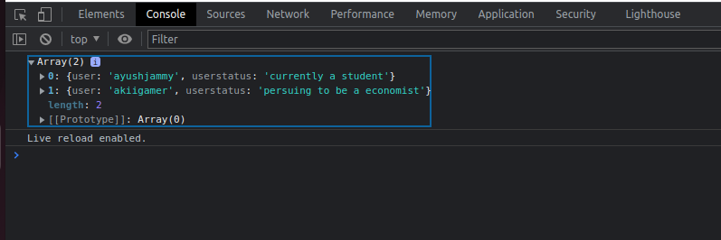

# JavaScript
Hey guys, lets checkout some basics of JavaScripts functions,lets go through each code one by one and learn something new.

## Description

I have uploaded two folders containing my work on some basic and advance concept on javascript such as Random number generation, animation on a div and many more..

## Advance
This folder contains some of the most used concept in JS.

- Animation on a div tag

- facebookfunctionality

- Random Number generation

- Reverse a string

- Scope Chain

- Track mouse movement

## Basic
This folder contains some basic concept of JS which is imp to be aware of while working on WebDev

- CRUD

- Datatype

- Expression and Operators

- functions

- Loops

- Search Filter